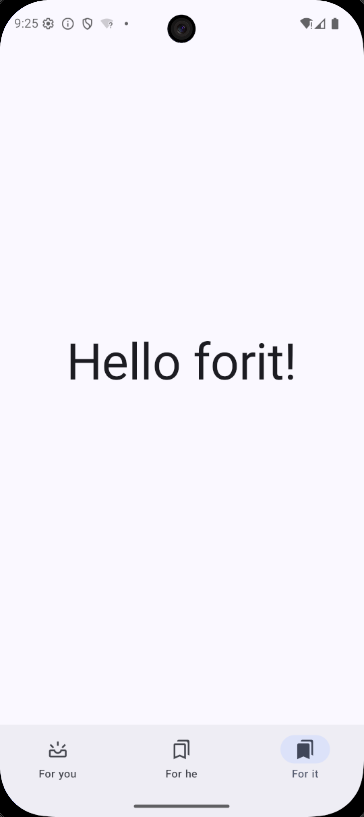

## 项目进展  
1.基于navigation3搭建页面基础框架  
2.添加自定义插件为后续模块处理@Hilt,viewModel相关注解做处理和对模块统一部分代码构建规则  
3.使用DataStore, Proto 定义文件,配合自定义注解持久化用户数据  
4.使用 Room 构建数据库，定义 NewsResourceEntity 与 TopicEntity 作为基础表存储新闻与分类，通过 NewsResourceTopicCrossRef 作为中间表实现多对多关联，并在 DAO 中提供相应的数据访问方法。

## 当前进度演示
